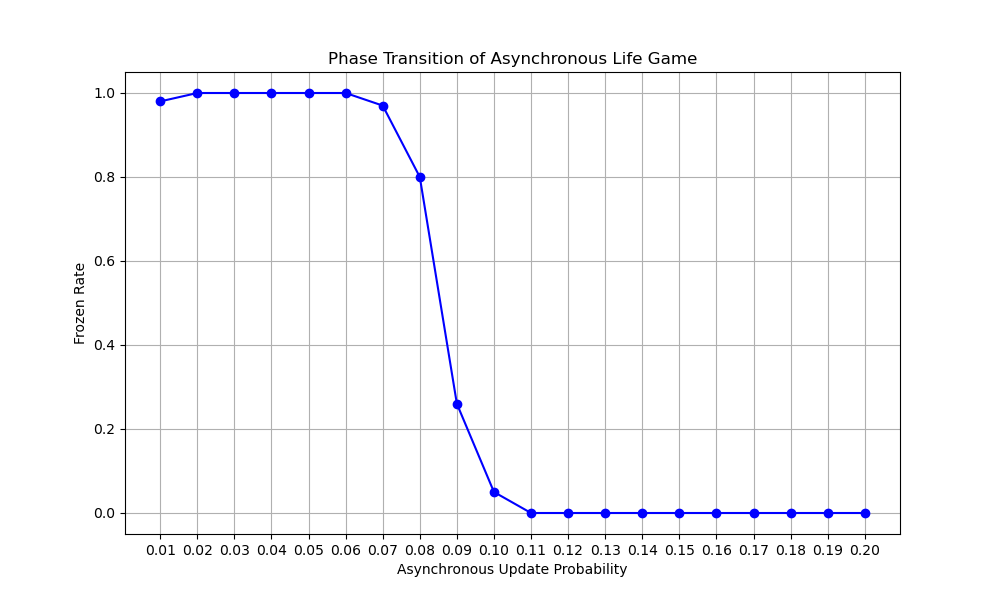

# PhaseTransition_Asynchronous_LifeGame

このリポジトリは、コンウェイのライフゲームの非同期版を実装し、シミュレーションを実行して結果を集計し、相転移を視覚化するためのツールを提供します。



## 目次
- [インストール](#インストール)
- [使用方法](#使用方法)
- [設定](#設定)
- [シミュレーションの実行](#シミュレーションの実行)
- [結果の集計](#結果の集計)
- [ライセンス](#ライセンス)

## インストール

1. リポジトリをクローンします：
    ```sh
    git clone https://github.com/yokyomitsu/PhaseTransition_Asynchronous_LifeGame.git
    cd PhaseTransition_Asynchronous_LifeGame
    ```

2. 仮想環境を作成して有効化します：
    ```sh
    conda create -m [your env-name]
    conda activate [your env-name]
    ```

3. 必要な依存関係をインストールします：
    ```sh
    pip install -r requirements.txt
    ```

## 使用方法

### 設定
config.yaml ファイルには、シミュレーションと集計の設定が含まれています：

```yaml
save_path: "ca_async_result"
n: 100  # 実行回数
start: 0.01
end: 0.20
step: 0.01
size: 150
max_t: 10000
cnt_states: 2
probabilities: [0.5, 0.5]
```

save_path: シミュレーション結果を保存するディレクトリ  
n: シミュレーションの実行回数  
start, end, step: 非同期更新確率の範囲とステップサイズ  
size: グリッドのサイズ  
max_t: 世代交代の最大数  
cnt_states: セルオートマトンの状態数  
probabilities: 初期状態の確率分布  

### シミュレーションの実行
config.yaml ファイルを適切なパラメータで設定してください。

シミュレーションスクリプトを実行します：
```sh
python main.py
```
結果は save_path ディレクトリ内のタイムスタンプ付きフォルダに保存されます。

### 結果の集計
config.yaml ファイルを適切なパラメータで設定してください。

main_aggregate.py スクリプトに集計するデータフォルダを指定します：

```python
data_folder = 'result_YYYYMMDD_HHMMSS'  # 実際のフォルダ名に置き換えてください
```

### 集計スクリプトを実行します：

```sh
python plot_result.py
```
グラフは指定したデータフォルダに保存されます。

### ライセンス
このプロジェクトはMITライセンスの下でライセンスされています。詳細はファイルをご覧ください。
